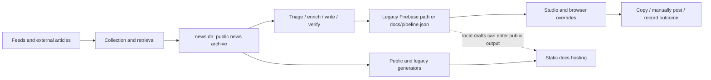

# Creator Studio baseline

Recorded 8 October 2026 (Asia/Karachi), against commit `888242a`, before foundation edits on `feat/creator-studio-foundation`. The supplied `creator_studio_codex_blueprint.pdf` is the design reference; implementation and acceptance are established from the actual checkout. No production credentials, database rules, account permissions, paid providers, or deployed services were inspected or changed.

## Code and data map

| Boundary | Existing source and behavior | Compatibility requirement |
| --- | --- | --- |
| Collection archive | `main.py`, `fetcher.py`, `filters.py`, `scoring.py`, `database.py`, `config.py`; SQLite `news.db` | Preserve archive tables, collector behavior, and public generators. Do not put Studio edits in the hourly overwritten archive. |
| Candidate selection | `agents/sources.py`, `agents/triage.py`; rule-based free mode and optional API mode | Preserve `candidates` and `settings.triaged.ids`, score reasons, shortlist/dismiss decisions, and the no-paid-key workflow. |
| Article preparation | `agents/enrich.py`; first sufficient primary/alternate article, excerpt limited to 7,000 characters | Preserve original/resolved URL and publisher; existing packs remain legacy excerpts, not verified multi-source evidence. |
| Writing and checks | `agents/angle.py`, `writer.py`, `verify.py`, `llm.py`, `content.py`; orchestrated by `run_pipeline.py` | Keep manual copy/paste and optional API stages. Do not promote generated angles to source evidence. |
| Editing and shared state | `agents/store.py` and `studio/app.js`; five dictionary collections, Firebase REST or local JSON/browser overrides | Keep old IDs, fields, status labels, schedules, published records, owner edits, and source links during additive migration. |
| Current Studio | `studio/index.html`, `app.css`, `app.js`; `generate_studio.py` emits `docs/studio.html` | Edit source and regenerate. Keep Today, Discover, Ideas, Compose, Schedule, Published, Library, Settings and keyboard/manual flows usable. |
| Public and legacy outputs | `generate_public.py`, `generate_site.py`, `generate_pulse.py`, `collectors/`, `analyzer/` | Preserve public data/output contract and legacy Studio; no visual redesign in the foundation slice. |
| Optional separate tools | `x-worker/`, `x-extension/`, `dashboard.py`, `plans.db` | Outside this implementation slice. Their presence does not establish Studio publishing or account authorization. |
| Automation | `.github/workflows/fetch.yml`, `pipeline.yml`, `pulse.yml` | Hourly collection/free preparation; API drafts on demand; Pulse every six hours. No LinkedIn publisher or dependable exact-time scheduler. |

### Baseline data shapes

`candidates`, `sources`, `drafts`, `settings`, and `runs` are dictionaries keyed by ID. The pipeline uses `SHA1(trimmed URL)[:12]`; these IDs must survive migration, with an explicit map to any added entities.

- Candidates include `title`, `url`, `source`, `published`, `summary`, `links`, `score`, `topic`, `status`, and owner curation.
- Source packs include original/resolved URL, publisher, publication time, `feed_summary`, `excerpt`, extracted `numbers` and `quotes`, `chars`, `ok`, `thin`, retrieval notes, and `fetched_at`. They lack immutable document revisions and evidence-span references.
- Drafts include `candidate_id`, `channel`, `post`, `first_comment`, `hashtags`, `claims`, `angle`, `verify`, `status`, and optional `edited_post`, `edited_comment`, `scheduled_for`, `published_at`, ratings/stats/notes. An explicitly empty owner edit must remain empty.
- Candidate labels include `new`, `low`, `shortlisted`, `dismissed`, `duplicate`, `skipped`, `drafted`, `published`; draft labels include `draft`, `approved`, `scheduled`, `published`, `rejected`.
- Browser `studio_overrides` stores unsynced per-document fields. Existing local caches and legacy history need an explicit import path; clearing them without preserving owner work is unacceptable.

## Measurements

Read-only SQLite/file inspection produced:

| Measurement | Baseline |
| --- | ---: |
| `news.db` items | 13,202 |
| Agent discoveries | 998 |
| Latest collection timestamp | `2026-10-08T01:54:55.287829+00:00` (06:54 Asia/Karachi) |
| Generated `docs/studio.html` | 1,292,203 bytes |
| Generated `docs/index.html` | 281,879 bytes |
| `studio/app.js` / `studio/app.css` | 114,703 / 78,651 bytes |

These are file size/archive observations, not network transfer, rendering, accessibility, or latency benchmarks. Prior chat claims about an October 1 snapshot do not describe this checkout.

## Existing capability versus target

Implementation status and new validation are maintained in [PROGRESS.md](PROGRESS.md).

| Capability | At baseline | Blueprint target |
| --- | --- | --- |
| Free LinkedIn writing | Manual prompt, JSON paste, edit, copy post/comment | Same working flow, schema-checked preview and shared prompt policies |
| LinkedIn preparation | Candidate plus one legacy excerpt; optional paid API drafts | Source-backed, platform-neutral story/evidence; LinkedIn variant linked to evidence |
| Private state | Screen passcode and derived Firebase path; local fallback in public `docs/` | One authoritative private store, owner authorization, local-private fallback |
| Concurrent edits | Timestamps, browser overrides, last write wins | Expected backend revisions, visible conflicts, retained unsynced edits |
| Approval | General draft field mutation from button/palette/shortcut | Authoritative guarded transitions, verification/approval bound to immutable revision |
| Images | Image prompt copy | Visual decision, approved revision, import/template/provider provenance and final asset review |
| Delivery | Manual handoff, browser schedule, owner marks posted | Explicit reminders/timezone and confirmation provenance; optional separately authorized publisher |
| Analytics | Owner-entered ratings and numbers | Observations with date/origin; no fabricated metrics or API availability |
| Future platforms | Product ideas and separate legacy X tooling | Contract-tested preparation adapters; all integrations accurately marked unavailable/unconfigured/unknown |
| Spending | Per-`LLM` in-memory counter | Persistent reservation/reconciliation ledger across runs and jobs |

## Data flow and threat map



| Boundary / finding reproduced from source | Impact | Required control / current limit |
| --- | --- | --- |
| Python and browser Firebase requests have no authorization token; passcode derives a path | Source does not establish owner authorization | Deny unauthenticated access in authoritative layer; deployed Firebase rules remain uninspected. README statements are not a rules audit. |
| Local store writes `docs/pipeline.json`; workflows stage public `docs/` or this file | Drafts/source excerpts may be published as static artifacts | Write private files outside public output and remove implicit draft commits; no tracked `docs/pipeline.json` existed at this baseline. |
| Client imports/updates general draft fields | Approval, delivery labels and credentials must not be accepted as imported authority | Strict safe schema and backend transitions; current client checks are insufficient. |
| Timestamp-only merge and cache surviving sign-out | Lost edits / private content left on shared devices | Revision conflicts, explicit cache lifecycle, browser edit export/import before migration. |
| Untrusted source/model text reaches prompts, URLs and HTML templates | Prompt injection, unsafe links/DOM, future SSRF risk | Treat as data, safe rendering, reject dangerous JSON keys; connection-time retrieval policy remains Phase 3 work. |
| Numeric checker permits angle text, naked numeric bases, years and small values | Unsupported claims can pass despite changed units/time/entity | Context-sensitive evidence checks for complete publishable package in Phase 4. |
| Enrichment retains one truncated selected article | Qualifications or contradictions can be missed | Distinct immutable sources, hashes, spans, retrieval outcomes and freshness; a migration must not relabel legacy data as verified. |
| `agents/sources.py` and Studio generation fall back from missing publication time to collection time | A newly retrieved old/undated story can look newly published | Keep publication/update/retrieval/event timestamps distinct and unknown publication dates unknown in Phase 3. |
| API writer and browser copy prompt assemble different context/output shapes; browser heuristically repairs JSON | Policy drift and potentially changed imported meaning | One versioned compiler, strict schema/import preview, visible bounded repair in Phase 4; no parity claim at baseline. |
| `content/examples.md` explicitly labels its posts as samples, including first-person test stories | Samples can be mistaken for real creator experience or measured best posts | Label examples honestly; exclude from factual grounding/performance learning; use story-scoped owner notes. |
| `content/linkedin_rules.md` mixes preferences with an unsourced asserted 2026 authenticity update | A creator preference or unverified algorithm claim can become a supposed platform constraint | Verify actual limits against current primary documentation during adapter work; do not reproduce the asserted update as fact. |
| `PIPELINE_DAILY_BUDGET_USD` checked against current-run spend before a call | Not a durable daily cap; next call can overshoot | Disable paid use during foundation work; implement reservations before cost activation. |
| Static hosting contains frontend only | Cannot safely keep provider secrets or run durable delivery jobs | Choose an authenticated server hosting boundary before deployed private editing or scheduling claims. |

## Verification and reproducible commands

The root agent reran the existing Python baseline: 64 tests passed. Both `node studio_test.js` and `node public_test.js` exited successfully with all checks passing. Exact commands/outcomes are recorded in [PROGRESS.md](PROGRESS.md), including skips and their reason.

Relevant offline commands:

```text
python -m unittest tests.test_pipeline tests.test_fetcher test_agent_ai_radar test_agent_discovery
node studio_test.js
node public_test.js
python generate_studio.py
python generate_public.py
```

Run state/provider tests with deterministic temporary files and mocked HTTP/providers. Generators can change generated timestamps/data; inspect diffs and isolate output when validating unrelated public/legacy behavior. Do not run live pipeline collection or paid generation merely to prove a foundation change.

## Migration and rollback baseline

1. Inventory local private state, browser edits and any owner-authorized legacy export; count each collection without logging full private content. Deployed export needs a separate authorized session.
2. Dry-run additive migration into a private target. Preserve legacy records and labels, record old-to-new IDs, use schema/revision metadata, and mark inherited verification/approval provenance honestly. Default delivery stays manual.
3. Check source/draft links, schedules, published records and explicitly empty edits. Do not replace a newer target with a repeat import. Reject malformed input before mutation.
4. Backup existing target and input before applying a reviewed local import. Write atomically, use conditional revisions, and retain backups outside `docs/` and version control. No permanent dual writes.
5. Roll back a failed import by restoring its private backup and checking counts/integrity. Preserve the untouched source export and browser cache until owner work is reconciled.
6. For code rollback, revert selected foundation commits or return to the recorded baseline in a separate checkout. Keep private state/backups separately and use a compatible schema reader. Do not reset the user's workspace or re-enable public-draft/unauthenticated storage as an incidental rollback.

Phase 1 is incomplete until deployed owner authentication, unauthorized-access tests, browser edit migration/cache lifecycle, and the private browser editing path are proven together. An offline repository and contracts alone do not satisfy that gate.
